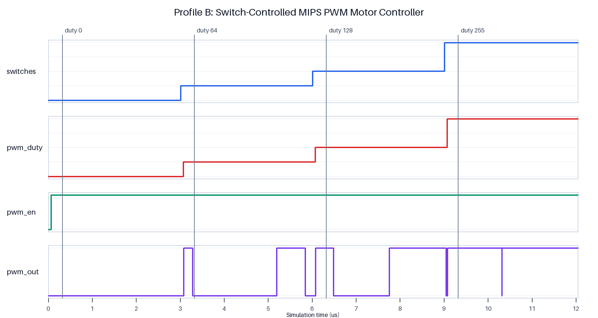

# Test Report: MIPS PWM Motor Controller
Robotics engineering 
2022028404 최제헌 Jeheon Choi
## 1. Motor Profile Verification

The implementation uses **Option B: switch-controlled duty**. The testbench
drives `switches` to four values: `0`, `64`, `128`, and `255`. For each value,
the MIPS program executes `lw` from MMIO address `0x90`, then `sw` to PWM duty
address `0x98`. The self-checking testbench confirms that the duty register
matches the switch input.



The waveform regions are:

| Region | Switch/duty | Expected PWM behavior |
| --- | ---: | --- |
| Disabled/reset | 0 | Output held low |
| Zero duty | 0 | Output remains low |
| Quarter scale | 64 | High for 64 of 256 clocks |
| Half scale | 128 | High for 128 of 256 clocks |
| Maximum code | 255 | High for 255 of 256 clocks |

The software loop has no cached target value: every iteration reads the external
input again. Therefore a switch change appears in the duty register after the
next loop iteration and the new width is visible in the following PWM period.

## 2. Edge Cases

### Enable equals zero

During reset, `pwm_en` is cleared and the PWM controller forces `pwm_out` low.
The assembly explicitly writes `1` to `0x9c` before entering the control loop.
The testbench checks that enable remains asserted after all profile values.

### Duty equals zero

With duty `0`, the comparison `counter < duty` is never true. The waveform shows
that `pwm_out` remains low for the entire period.

### Duty equals 255

With duty `255`, `pwm_out` is high for counter values `0` through `254` and low
for counter value `255`. This is the expected maximum representable result for
an 8-bit counter/comparator PWM.

### Rapid switch changes

If switches change faster than the software loop, intermediate values can be
missed because MMIO is sampled by `lw`. This is acceptable for physical switches
and motor control, whose meaningful changes are much slower than the CPU loop.
The final stable value is read and propagated to duty.

## 3. Reproduction

Run:

```sh
make clean
make
```

Expected terminal checks:

```text
PASS: switches=0 -> duty=0
PASS: switches=64 -> duty=64
PASS: switches=128 -> duty=128
PASS: switches=255 -> duty=255
PASS: Profile B MMIO and PWM simulation completed
```

The run also creates `mips.vcd`, which can be opened with:

```sh
gtkwave mips.vcd
```
